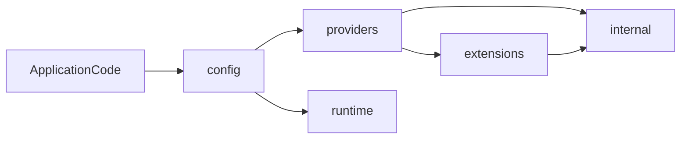
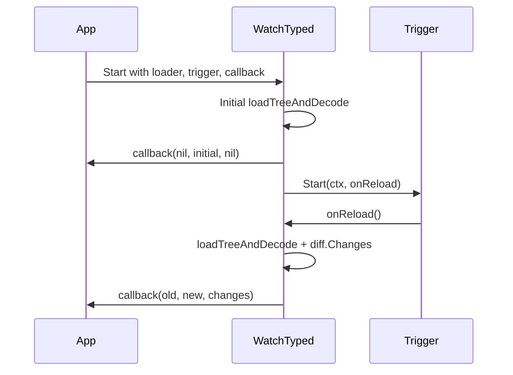

# go-config - Technical Specification

## 1. Overview

`go-config` is a deterministic, pipeline-based configuration system for Go.

The loading model is explicit:

```text
Source -> Parse -> Merge -> Resolve -> Decode -> Validate
```

Each stage is defined by a contract interface and can be replaced independently.

## 2. Core architecture

### 2.1 Pipeline model

Stage flow:

`Source -> Parse -> Merge -> Resolve -> Decode -> Validate`

Execution is orchestrated by `config.Loader` through `Load` and `LoadTyped[T]`.
Detailed stage semantics, ordering rules, and fast-path constraints are documented in [Pipeline Reference](#10-pipeline-reference).

### 2.2 Contracts

Core contracts are in `config/`:

- `Source`
- `Parser`
- `TypedParser` (optional parser fast path)
- `merge.Strategy`
- `Resolver`
- `Decoder`
- `Validator`
- `ReloadTrigger` (runtime reload trigger contract)

Design properties:

- minimal
- composable
- independently testable

### 2.3 Typed loading

Primary APIs:

- `(*Loader).Load(ctx, out)`
- `LoadTyped[T](ctx, loader)`
- `LoadWithSpec(ctx, out, spec)`
- `LoadTypedWithSpec[T](ctx, spec)`

Typed loading gives:

- compile-time target typing at call sites
- isolated loader instances (no global mutable config singleton)
- deterministic per-call pipeline behavior
- optional high-level app-policy declaration via `Spec`

## 3. Providers

### 3.1 Sources

Implemented built-in sources:

- `providers/source/file`
- `providers/source/env`
- `providers/source/memory`
- `providers/source/bytes`
- `providers/source/flag`

Source metadata via `AddSourceWithMeta`:

- `Priority` controls merge ordering (ascending; higher priority merged later)
- `Required` controls read failure handling (optional sources can be skipped)

`env` source supports prefix filtering and nested key mapping via `__` segments.

### 3.2 Parsers

Implemented parsers:

- JSON parser (`providers/parser/json`, stdlib `encoding/json`)
- YAML parser (`providers/parser/yaml`, Rust/WASM backend)
- TOML parser (`providers/parser/toml`, Rust/WASM backend)

`TypedParser` is supported as an optional direct decode path when loader constraints allow it.

### 3.3 Merge strategies

Implemented strategies:

- Deep recursive merge (`providers/merge/deep`)
- Top-level replace (`providers/merge/replace`)

Merge behavior in loader:

- stable ordering (`sort.SliceStable`)
- priority-based (`SourceMeta.Priority`)
- optional-source read failures handled before merge

### 3.4 Resolvers

Implemented placeholder/reference resolvers:

- `${ENV:KEY}` via `providers/resolver/env`
- `${FILE:path}` via `providers/resolver/file`
- `${REF:path}` via `providers/resolver/ref`

Resolvers can be composed sequentially via `providers/resolver/chain`.

### 3.5 Decoders

Implemented decoders:

- mapstructure-style decode (`providers/decoder/mapstructure`)
- strict decode (`providers/decoder/strict`, unknown field detection)

Optional direct decode fast path exists in `Loader` when:

- `WithDirectDecode(true)` is set
- exactly one source is configured
- parser implements `TypedParser`
- no resolver is configured

### 3.6 Validators

Implemented validator paths:

- no-op validator (default)
- function-based validator (`providers/validator/playground`)
- WASM policy validator (`extensions/wasm/validator/rustpolicy`)

## 4. Runtime system

`go-config` runtime support centers on live reload, diff reporting, and trigger backends.

For full lifecycle semantics, concurrency notes, trigger behavior, and operational guidance, see [Runtime and reload reference](#11-runtime-and-reload-reference).

## 5. Extension system

Extensions keep optional capabilities outside the core pipeline while preserving composability.

For the full parser/runtime/validation/schema breakdown and the validation ABI contract, see [Extensions reference](#12-extensions-reference).

## 6. Package boundaries

| Package | Responsibility |
| ------- | -------------- |
| `config/` | Public contracts, loader orchestration, options, load/watch API |
| `providers/` | Source/parser/merge/resolver/decoder/validator implementations |
| `runtime/` | Diff model and reload trigger backends |
| `extensions/` | Optional WASM and schema capabilities |
| `internal/` | Shared non-public helpers |



## 7. Error model

Pipeline stage failures are wrapped with stage sentinels:

- `ErrSourceReadFailed`
- `ErrParseFailed`
- `ErrMergeFailed`
- `ErrResolutionFailed`
- `ErrDecodeFailed`
- `ErrValidationFailed`

This enables stage-level handling while preserving underlying error context.

## 8. Performance considerations

Current implementation-level mechanisms:

- optional direct decode fast path (`TypedParser` + `WithDirectDecode`)
- WASM parser/validator execution via reusable engines
- benchmark and reporting tooling in `tooling/benchmarks` and `tooling/reports`

## 9. Design principles

- no global mutable configuration state
- explicit stage contracts over implicit behavior
- deterministic ordering and merge semantics
- composable provider model
- testability-first boundaries

## 10. Pipeline reference

This section is the canonical stage-semantics reference for `Load` and `LoadTyped`.

### 10.1 Stage flow


### 10.2 Execution order and precedence

- Sources are registered in order with `AddSource` or `AddSourceWithMeta`.
- Merge ordering is stable-sorted by `SourceMeta.Priority` ascending.
- Higher priority is merged later and therefore wins on conflict.
- Equal priority preserves registration order.

### 10.3 Read and parse semantics

- `TreeDocument` values skip parse and are merged directly.
- `Document` values require an explicit parser binding for the source.
- Optional sources (`Required: false`) that fail read are treated as empty trees.
- `MissingPolicy` can ignore missing-source read failures while keeping other read failures strict.
- `ParsePolicy` can ignore parser failures for a source and continue with an empty tree.

### 10.4 Merge and resolve semantics

- Merge strategy is configurable (`deep` default, `replace` optional).
- Resolver is optional and runs once on the fully merged tree.
- Resolver failures are surfaced as `ErrResolutionFailed`.

### 10.5 Decode and lifecycle semantics

- Decoder is mandatory and maps merged trees into typed output.
- Post-decode lifecycle order is deterministic:
  1. `ApplyDefaults()` interface (if implemented by target)
  2. defaults callback (`WithDefaultsFunc`)
  3. validate callback (`WithValidateFunc`)
  4. validator interface (`WithValidator`)
- Decode, defaults, and validate failures are wrapped with stage-specific sentinels.

### 10.6 Explain/provenance trace semantics

- Trace capture is optional (`WithTrace` / `Spec.Trace`).
- Trace records flattened key candidates across source merge order.
- Each key includes final winner source/value plus overridden candidates.
- Trace also captures lifecycle hook execution order for debugging and migration parity.

### 10.7 Direct decode fast path

When `WithDirectDecode(true)` is set, a fast path can bypass tree materialization if all constraints hold:

- exactly one source
- resolver disabled
- source parser implements `TypedParser`
- source returns `Document`

If constraints fail, the loader falls back to the standard pipeline.

### 10.8 Typical failure map

- missing target: `ErrNilTarget`
- no sources: `ErrNoSources`
- decoder missing: `ErrDecoderRequired`
- raw document without parser / unknown format / invalid document: `ErrParserRequired`, `ErrUnknownFormat`, `ErrInvalidDocument` (as applicable)
- stage failures: parse/merge/resolve/decode/validate sentinel errors

## 11. Runtime and reload reference

Runtime capabilities center on live reload and change tracking.

### 11.1 Core reload API

`config.WatchTyped[T]` performs:

1. initial typed load
2. callback with `(nil, initial, nil)`
3. trigger startup (`ReloadTrigger.Start`)
4. reload loop on trigger events
5. callback with `(old, new, changes)`

The function blocks until context cancellation, then stops the trigger.

### 11.2 Reload lifecycle



### 11.3 Diff model

`runtime/diff` reports path-level changes:

- `KindAdd`
- `KindRemove`
- `KindChange`

Paths are dot-separated (`server.port`), and nested map diffs are reported at leaf paths.

### 11.4 Trigger backends

- `runtime/watch/fsnotify`:
  - validates watched paths are regular files
  - uses OS event backends on Linux/macOS
  - falls back to polling on Windows/other platforms
  - supports debounce (`DefaultDebounce`)
- `runtime/watch/polling`:
  - fixed-interval callbacks
  - stdlib-only implementation

### 11.5 Concurrency and callback behavior

- Reload handler execution is serialized with a mutex in `WatchTyped`.
- Each successful reload decodes into a new typed snapshot.
- Callback receives immutable old/new values per event.
- Reload errors inside `onReload` are currently swallowed (event ignored).

### 11.6 Operational guidance

- Use the same file paths for source + watcher to avoid mismatch.
- Always cancel context for graceful shutdown.
- Keep callback work bounded to avoid reload backpressure.
- Use polling trigger where filesystem events are unavailable or undesirable.

## 12. Extensions reference

Extensions add optional capabilities while keeping core pipeline dependencies small.

### 12.1 Extension areas

- `extensions/schema/*`: schema generation and inference helpers.
- `extensions/wasm/parser/*`: embedded WASM parser adapters.
- `extensions/wasm/runtime/wazero`: shared WASM runtime engine.
- `extensions/wasm/validator/*`: WASM-based validation engine and policies.

### 12.2 Schema extensions

- `extensions/schema/generate`: produce JSON Schema from Go types.
- `extensions/schema/infer`: infer best-effort schema from merged config trees.

Use generation for typed API contracts and inference for introspecting dynamic trees.

Inference behavior caveats:
- Array inference currently uses first-element heuristics for heterogeneous arrays.
- Unsupported or nil-like dynamic values produce unconstrained schema nodes.

### 12.3 WASM parser extensions

Parser adapters include:

- `extensions/wasm/parser/rustyaml`
- `extensions/wasm/parser/rusttoml`
- `extensions/wasm/parser/rustjson`

Provider packages call these adapters and expose parser interfaces at `providers/parser/*`.

### 12.4 WASM runtime engine

`extensions/wasm/runtime/wazero` owns module lifecycle:

- compile/instantiate module
- write input bytes to WASM memory
- call ABI exports (`wasm_alloc`, `wasm_dealloc`, `parse`, `output_ptr`, `output_len`)
- decode transport output

Current parser transport expects `GCFGMP1` prefix followed by a Msgpack payload; the host decodes that payload with `github.com/vmihailenco/msgpack/v5` (declared in the module for `extensions/wasm/runtime/wazero`).

### 12.5 WASM validation extension

- `extensions/wasm/validator/engine` provides validation runtime execution.
- `extensions/wasm/validator/rustpolicy` provides default policy-based validator wrappers.
- Custom WASM policy modules are supported via bytes/module path constructors.

#### Validation WASM ABI

Policy and validation modules used by the WASM validator must export the following ABI:

| Export | Signature | Purpose |
| ------ | --------- | ------- |
| `wasm_alloc` | `(size: u32) -> u32` | Allocate buffer in guest memory; host writes config JSON here. |
| `wasm_dealloc` | `(ptr: u32, size: u32)` | Free buffer. |
| `validate` | `(ptr: u32, len: u32) -> i32` | Run validation on JSON at `ptr/len`; `0` means pass and non-zero means fail. |
| `error_ptr` | `() -> u32` | Pointer to UTF-8 error message after failed `validate`. |
| `error_len` | `() -> u32` | Length of error message in bytes. |

- Input: host allocates guest memory with `wasm_alloc`, writes JSON, then calls `validate(ptr, len)`.
- Output: when `validate` returns non-zero, host reads the message from `error_ptr` and `error_len`.
- Memory: no WASI requirement for this ABI; default policy is built as `wasm32-wasip1` for consistency.

Custom policy binaries that export this ABI can be loaded with `rustpolicy.NewFromBytes(ctx, wasmBytes)`.

### 12.6 Artifact and lifecycle notes

- `.wasm` parser/policy artifacts are embedded and versioned in extension package directories.
- Parser and validator engines should be closed when no longer needed.
- YAML shared parser flow uses reference-counted reuse for hot-path performance.

## 13. Compatibility harness reference

Phase 4 compatibility guarantees are validated with fixture-driven contract tests in `config/contract_compatibility_test.go` and fixture inputs under `testdata/compat/`.

### 13.1 Harness contract

- Input model:
  - one fixture per consumer profile (`*.json`)
  - prioritized in-memory trees (`trees[]`)
  - optional env overlay policy (`env.prefix`, `env.infer`, `env.precedence`, `env.bindings`, `env.vars`)
  - expected typed projection (`expected`)
  - expected provenance winners (`expected_trace`)
- Execution model:
  - tests build `config.Spec` from fixture data only
  - config is loaded via `LoadTypedWithSpec` with `Trace` enabled
  - no app-specific adapter hooks or wrapper-side behavior assumptions
- Comparison model:
  - typed output is canonicalized to a deterministic JSON snapshot
  - parity is strict no-diff (`want` vs `got`) with a single failure format
  - trace assertions validate final source winners for selected compatibility keys

### 13.2 Maintained scenario profiles

- `security_strict_profile`: strict typed profile with env alias override.
- `multi_source_profile`: priority merge across multiple trees with env inferred override.
- `env_heavy_override_profile`: env-forward profile with explicit-vs-inferred alias precedence.

### 13.3 CI and release gate

- Compatibility contracts use `TestContract_Compat_*` naming and run in contract lanes.
- Release validation treats compatibility parity as a mandatory gate alongside policy contract tests.
