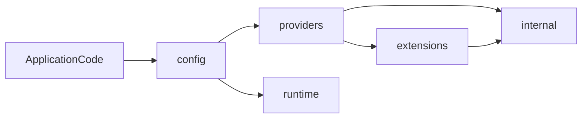

# Architecture

This document describes how `go-config` is structured and where responsibilities live.

## Goals

- Typed-first loading into application structs.
- Deterministic, explicit pipeline behavior.
- Dependency-light core with optional capabilities isolated in extension packages.

## Package boundaries

- `config/`: core loader, contracts, options, and watch orchestration.
- `providers/`: pluggable implementations for source/parser/merge/resolver/decoder/validator interfaces.
- `runtime/`: reload-related primitives (`diff`, watch backends).
- `extensions/`: optional schema generation and WASM-powered features.
- `internal/`: non-public helper packages used by providers and internals.

## Architectural map

## Core contracts

The core contract set in `config/` defines interchangeable pipeline stages:

- `Source`: reads config input as `Document` or `TreeDocument`.
- `Parser` and `TypedParser`: parse bytes or parse directly into typed targets.
- `merge.Strategy`: combines trees from multiple sources.
- `Resolver`: transforms merged trees (placeholder expansion, indirection).
- `Decoder`: maps tree data into typed structs.
- `Validator`: post-decode validation hook.
- `ReloadTrigger`: runtime signal for reload cycles.

## Data model

Two document models feed the loader:

- `Document`: raw bytes + format metadata, requires parser.
- `TreeDocument`: pre-built `map[string]any`, bypasses parser.

Both converge to a merged tree and decode into a typed output target.

## Dependency policy

- Core orchestration should stay stdlib-first and contract-oriented.
- Optional parser/validator acceleration (WASM runtime, ABI concerns) remains in `extensions/*` and provider edges.
- Reload backend specifics stay in `runtime/watch/*` rather than in `config/`.

## Error model

Pipeline failures are stage-tagged via sentinels in `config/errors.go` and wrapped with stage context:

- read: `ErrSourceReadFailed`
- parse: `ErrParseFailed`
- merge: `ErrMergeFailed`
- resolve: `ErrResolutionFailed`
- decode: `ErrDecodeFailed`
- validate: `ErrValidationFailed`

This keeps error handling predictable while preserving inner error details.
