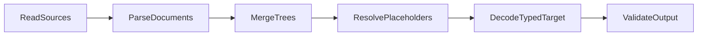

# Pipeline

`Load` and `LoadTyped` execute a deterministic, stage-based pipeline.

## Stage flow

## Execution order and precedence

- Sources are registered in order with `AddSource` or `AddSourceWithMeta`.
- Merge ordering is stable-sorted by `SourceMeta.Priority` ascending.
- Higher priority is merged later and therefore wins on conflict.
- Equal priority preserves registration order.

## Read and parse semantics

- `TreeDocument` values skip parse and are merged directly.
- `Document` values require an explicit parser binding for the source.
- Optional sources (`Required: false`) that fail read are treated as empty trees.

## Merge and resolve semantics

- Merge strategy is configurable (`deep` default, `replace` optional).
- Resolver is optional and runs once on the fully merged tree.
- Resolver failures are surfaced as `ErrResolutionFailed`.

## Decode and validate semantics

- Decoder is mandatory and maps merged trees into typed output.
- Validator is optional and runs only after successful decode.
- Decode and validate failures are wrapped with stage-specific sentinels.

## Direct decode fast path

When `WithDirectDecode(true)` is set, a fast path can bypass tree materialization if all constraints hold:

- exactly one source
- resolver disabled
- source parser implements `TypedParser`
- source returns `Document`

If constraints fail, the loader falls back to the standard pipeline.

## Typical failure map

- missing target: `ErrNilTarget`
- no sources: `ErrNoSources`
- decoder missing: `ErrDecoderRequired`
- stage failures: parse/merge/resolve/decode/validate sentinel errors
