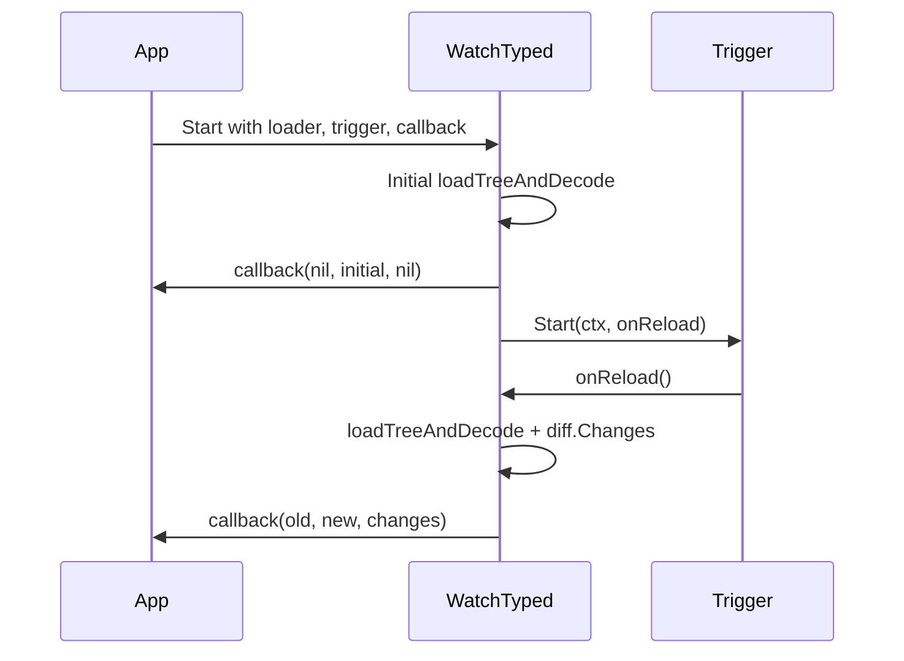

# Runtime

Runtime capabilities center on live reload and change tracking.

## Core reload API

`config.WatchTyped[T]` performs:

1. initial typed load
2. callback with `(nil, initial, nil)`
3. trigger startup (`ReloadTrigger.Start`)
4. reload loop on trigger events
5. callback with `(old, new, changes)`

The function blocks until context cancellation, then stops the trigger.

## Reload lifecycle

## Diff model

`runtime/diff` reports path-level changes:

- `KindAdd`
- `KindRemove`
- `KindChange`

Paths are dot-separated (`server.port`), and nested map diffs are reported at leaf paths.

## Trigger backends

- `runtime/watch/fsnotify`:
  - validates watched paths are regular files
  - uses OS event backends on Linux/macOS
  - falls back to polling on Windows/other platforms
  - supports debounce (`DefaultDebounce`)
- `runtime/watch/polling`:
  - fixed-interval callbacks
  - stdlib-only implementation

## Concurrency and callback behavior

- Reload handler execution is serialized with a mutex in `WatchTyped`.
- Each successful reload decodes into a new typed snapshot.
- Callback receives immutable old/new values per event.
- Reload errors inside `onReload` are currently swallowed (event ignored).

## Operational guidance

- Use the same file paths for source + watcher to avoid mismatch.
- Always cancel context for graceful shutdown.
- Keep callback work bounded to avoid reload backpressure.
- Use polling trigger where filesystem events are unavailable or undesirable.
